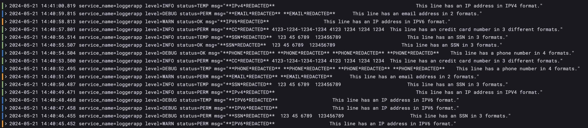

# Demo 1 - using Mac OSX and Homebrew


## Instructions

All of the steps below have been tested on MacOS 14.4.

&nbsp;  
### 1) Install Grafana Alloy
https://grafana.com/docs/alloy/latest/get-started/install/macos/

Run the basic tests documented there to see that Alloy can start up, you can see its log files, you can shut it down, etc.

&nbsp;  
### 2) Clone this repository
Use git to clone this repo: 

```git clone https://github.com/danstadler-pdx/grafana-alloy-pii-demo```

In a terminal, cd into the project directory, then into demo01-homebrew.

&nbsp;  
### 3a) [Option 1] Create environment variables
If running homebrew, and if you want to use environment variables, [you have to edit Alloy's service file](https://grafana.com/docs/alloy/latest/tasks/configure/configure-macos/#configure-the-alloy-service),
and add environment variables directly in that file.

Example:
```
    <snip>
    service do
      environment_variables \
        MASK_MODULE_PATH:        "[MY_LOCAL_CLONE_PATH]/downloaded-alloy-modules/mask-module-testing.alloy",
        LOKI_URL:                "[MY_LOKI_HOST]",
        CLOUD_LOGS_TENANT_ID:    "[MY_CLOUD_LOGS_TENANT_ID]",
        CLOUD_LOGS_WRITE_TOKEN:  "[MY_CLOUD_LOGS_WRITE_TOKEN]"
      run [
        opt_bin/"alloy", "run", etc/"alloy/config.alloy",
    </snip>
```
(example for MY_LOKI_HOST: https://logs-prod3.grafana.net/loki/api/v1/push )

After doing that, you have to run:

```brew reinstall alloy```


&nbsp;  
### 3b) [Option 2] Hardcode variables in your configuration file
Alternatively, you can uncomment and use the example lines in alloy.config and add your values directly. 
- Remember to work safely with these values; don't check them into source code management or otherwise expose them.
- Also be sure to comment the lines that pull from env vars.
- Note that Alloy supports [pulling configuration values from Vault](https://grafana.com/docs/alloy/latest/reference/components/remote.vault/).

&nbsp;  
### 4) Replace Alloy's default configuration with your configuration.
Alloy places its main configuration file into specific locations depending on your install choice. 
[This page shows you how to find the location for OSX](https://grafana.com/docs/alloy/latest/tasks/configure/configure-macos/#configure-grafana-alloy-on-macos)

As of May 2024, the documentation lists this location as:

```$(brew --prefix)/etc/alloy/config.alloy```

After backing up Alloy's default configuration file somewhere safe, use the tool of your choice to copy the entire content of this demo's config.alloy file, and overwrite that into your machine's actual alloy config. Save the updated config file.

&nbsp;  
### 5) Start Alloy

```brew services start alloy```

In the same or a new terminal, tail the app's logfile. [Instructions are here](https://grafana.com/docs/alloy/latest/get-started/run/macos/#view-alloy-logs-on-macos).

As of May 2024, the documentation lists this location as:

``` $(brew --prefix)/var/log/alloy.err.log ```

You should see Alloy's normal startup log messages. The config file is set to "debug" level, so if things don't
work, you should be able to scan the log messages and see what might have gone wrong.

If Alloy has successfully launched, you can [view its UI in a browser](http://localhost:12345) on the host where you are running this demo.


&nbsp;  
### 6) Start loggerapp
In a separate terminal, cd into the logger-app directory.

Start loggerapp:

```./loggerapp.sh```

Alloy's log file (tailed in the prior step) should now show a lot of output, as log lines are processed, and
PII strings get redacted.

&nbsp;  
### 7) View logs in Grafana
In your Grafana Cloud instance, go to Explore, switch to your Logs datasource (the same one you generated a write
token for), and look for your inbound logs. If you have not modified your filename or labels from the defaults
provided in this demo, this LogQL query should work for you:

``` {filename="/tmp/alloy-logs/loggerapp.log", job="loggerapp123"} ```

Assuming everything is working, you should be seeing log messages from loggerapp, with redactions where the configured regex rules have detected PII.




&nbsp;  
### 5) Stop loggerapp and Alloy
In the terminal running loggerapp.sh, use ctrl-c to stop the program.

In the terminal running Alloy, you can use this to stop the service:

```brew services stop alloy```

&nbsp;  
## Other notes

### What this first demo is for
This first demo is designed specifically to give developers a way to test and better understand some specific parts of the Grafana solution. It's definitely not meant as a recommendation for any kind of production-quality setup.

The next demo (Docker) moves closer to a more real environment, by having Alloy call out to this Github repo and pull down its configuration. This is not a hard requirement for any customer environment; but it does provide a better demo of how Alloy is designed to work in infrastructure-as-code environments.

The final demo also uses remotely stored configuration, and then adds the step of wrapping both Alloy and the logger app into k8s Deployments. Again - just an example of using Alloy in a more "realistic" setting.

&nbsp;  
### Demo uses "fake" labels
In this first demo, you may have noticed that in config.alloy, there is a block at the end of the file which adds some "fake" labels every log line, prior to the invocation of the PII masking pipeline. In a more realistic environment, this would not be needed; you'd likely already have some labels added, and the labels such as 

```logs_grafana_com_mask_credit_card=true``` 

would come from k8s annotations, and be flattened into that format by other mecahnisms. 

The next demos (Docker, Kubernetes) will introduce more pieces of this, in order to show how this will work in real (i.e. K8s) environments.

