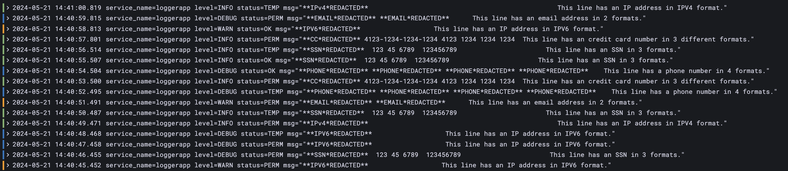

# Demo 3 - using Kubernetes

## What's different from demo02-docker?

Like demo02-docker, this version of the demo is still using the loggerapp, and still configuring 
Alloy to read/mask/forward the log files to the Grafana Cloud account that you configure.

Also, we're still taking advantage of using import.git to download our masking module from this repo.

On the other hand, some things are different in this demo.

1) We're now moving on to using k8s, instead of local/homebrew or Docker. (The instructions below contain simple steps to setup k3d on your Mac if needed.)

2) Since we're on k8s, we deploy loggerapp with the proper k8s annotations needed to instruct the masking module that we want masking done on this container's logs.

3) We're moving on to using [Grafana's k8s integration Helm project](https://github.com/grafana/k8s-monitoring-helm) for installing alloy.
 

&nbsp;  
## Instructions

All of the steps below have been tested on MacOS 14.4.

Before starting: if you haven't run through demo01 and demo02, you might want to head over to their README pages and at least familiarize yourself with how they work.

As with those demos, you will need to clone this repo, cd into its root directory, and then cd into this demo's directory.


&nbsp;  
### 1) Get yourself setup with kubernetes, kubectl, and Helm
You are welcome to do this any way you prefer. For the testing I've done with this demo, I have used the following solutions (using the supplied homebrew instructions whenever available):

1) [Install k3d](https://k3d.io/)
2) [Install kubectl](https://kubernetes.io/docs/tasks/tools/install-kubectl-macos/#install-kubectl-on-macos)
3) [Install Helm](https://helm.sh/docs/intro/install/)
4) [Install k9s]()

If you prefer a different solution, just be sure that you can run basic "hello world" tests of all the solutions above.

At a few points through these instructions, I'll give pointers for those trying out k9s for the first time.


&nbsp;  
### 2) Start loggerapp.sh
The working directory for the next steps, unless mentioned otherwise, is ```demo03-k8s/```.

For the current step we're on, there is a subdirectory: ```1-deploy-loggerapp```. This directory has the yaml file you'll need for starting loggerapp as a k8s pod.

Before deploying loggerapp: take a quick look at ```[your clone directory]/logger-app/loggerapp.sh```; check out the new comments at the beginning and end of the file. For the prior demos, we were writing out the log data to a specific path/file. In this version, we are writing to stdout; k8s will route the log data to a standard location and Alloy will know to look there.

An image of this "write to stdout" version of the code is already published and publicly available, so you won't have to build or publish this modified version yourself. [It is here](https://hub.docker.com/repository/docker/danstadler/demo02-docker-loggerapp/general).

To start loggerapp, run this:

```kubectl apply -f 1-deploy-loggerapp/loggerapp.yaml```

If using k9s, you can switch to ```pods```, click (i.e. hit the enter key) on the loggerapp pod, then again on the container itself, and you should see the logs printing out (not yet redacted - this is just the literal output coming from loggerapp.)


&nbsp;  
### 3) Deploy the K8s integration
Our next step is to deploy the [k8s monitoring](https://github.com/grafana/k8s-monitoring-helm) Helm project. We'll do this with all default values in place, so after this step, you'll see the loggerapps logs coming in to your cloud account, but they won't be redacted just yet.

In the directory ```demo03-k8s/2-deploy-alloy-via-grafana-k8s-integration```, there is an example of a Helm values file called "value-original.yaml". To make your own version, you can go to your Grafana Cloud account, and to the K8s configuration section, generate your own testing token, and then save the resulting values file in the ```2-deploy-alloy-via-grafana-k8s-integration``` directory with the filename "values.yaml".

(Be sure to name your file "values.yaml". Note that this exact path/filename appears in this project's .gitignore, giving you a safety check on not commiting your own tokens or other identifying information into source control. But please continue to be careful with information like this.)

Your next step is to deploy Grafana's k8s integration to your dashboard:

```helm install grafana-k8s-monitoring grafana/k8s-monitoring --namespace "default" --values ./2-deploy-alloy-via-grafana-k8s-integration/values.yaml```

If you use k9s to watch the deployment (i.e. go to pods mode, watch the pods unfurl), you should first see the initial testing pod come up, then you should see the full Alloy deployment come up - a metrics pod, a logs pod for every node you are running, etc.

When you have at least one logs pod running, you should be able to use Explore in Grafana Cloud to see the logs coming in. Again, these are not yet redacted, because we haven't yet modified our alloy.config for our logging pods.


&nbsp;  
### 4) Modify the alloy config of the logs pod(s)
Before running this part; it might be helpful to look in your K8s cluster and find the configMap called ```grafana-k8s-monitoring-alloy-logs```, and glance over its content. You could even save that content to a local file for later comparison; we are about to replace that content with a modified version, in order to complete what's needed for this demo. 

To modify our alloy config, we're going to use a modified version of [the instructions here](https://grafana.com/docs/alloy/latest/tasks/configure/configure-kubernetes/). Those instructions are written for deploying Alloy standalone, via Alloy's own Helm chart. We on the other hand are using the [k8s monitoring](https://github.com/grafana/k8s-monitoring-helm) Helm chart, which bundles the Alloy helm chart as well as several other charts.

This means that we can use similar directions as in the above docs page, but they are modified just a bit.

In [this section of the docs](https://grafana.com/docs/alloy/latest/tasks/configure/configure-kubernetes/#method-2-create-a-separate-configmap-from-a-file), you can see how it's possible to create a custom config map in a file you save locally, and then use helm commands to create a new config that uses that file. 

In the directory ```demo03-k8s/3-modify-alloy-config```, there is already a file called "config.alloy". This file contains a recently generated version of an Alloy logs config, with some modifications, for example the ```import.git``` component you've seen in the prior demos.

(Over time, the k8s-monitoring-helm chart or the Alloy helm chart will change. Therefore these instructions might stop working at some point; in that case, consider looking at what the latest charts build, and compare that to what's still in this demo; file issues here as appropriate.) 

Note that you don't need to edit anything for ```demo03-k8s/3-modify-alloy-config/config.alloy``` file:
1) The values to pull down the masking module code are hard-coded (but you could modify this setup to meet your needs), and
2) The credentials needed for Alloy to ship to Grafana Cloud were already provided as Secrets during the initial run of Helm; our new config.alloy file just references those secrets, same as the out-of-the-box version did.

Now you can run these 2 commands:

```kubectl delete configmap --namespace default grafana-k8s-monitoring-alloy-logs```

```kubectl create configmap grafana-k8s-monitoring-alloy-logs --from-file ./3-modify-alloy-config/config.alloy -o yaml --dry-run=client | kubectl apply -f -```

There is more than one way to get Alloy to reload its configuration file; an easy one is just to wait. I believe that as of this writing, the check frequency is 1m, so just wait a minute and then go look at your latest logs coming in via Explore.


&nbsp;  
### 5) View logs in Grafana
In your Grafana Cloud instance, go to Explore, switch to your Logs datasource (the same one you generated a write
token for), and look for your inbound logs. If you have not modified your filename or labels from the defaults
provided in this demo, this LogQL query should work for you (change the cluster name as needed):

``` {cluster="my-cluster"} |= `loggerapp` ```

Assuming everything is working, you should be seeing log messages from loggerapp, with redactions where the configured regex rules have detected PII.




&nbsp;  
### 6) Tear down

Tear down loggerapp:
```kubectl delete -f 1-deploy-loggerapp/loggerapp.yaml```

Tear down the k8s integration:
```helm delete grafana-k8s-monitoring --namespace "default"```


&nbsp;  
## Other notes

### TODO: Add a few sections

1) how did that work:
- loggerapp has annotations
- config has the imported/configured masking module
- config also has some label rewrites

2) optional lower level details
- dive into label renaming
- dive into using the reduced example
- show the process of testing one step at a time

-----------------------------------------------------------------------------------

